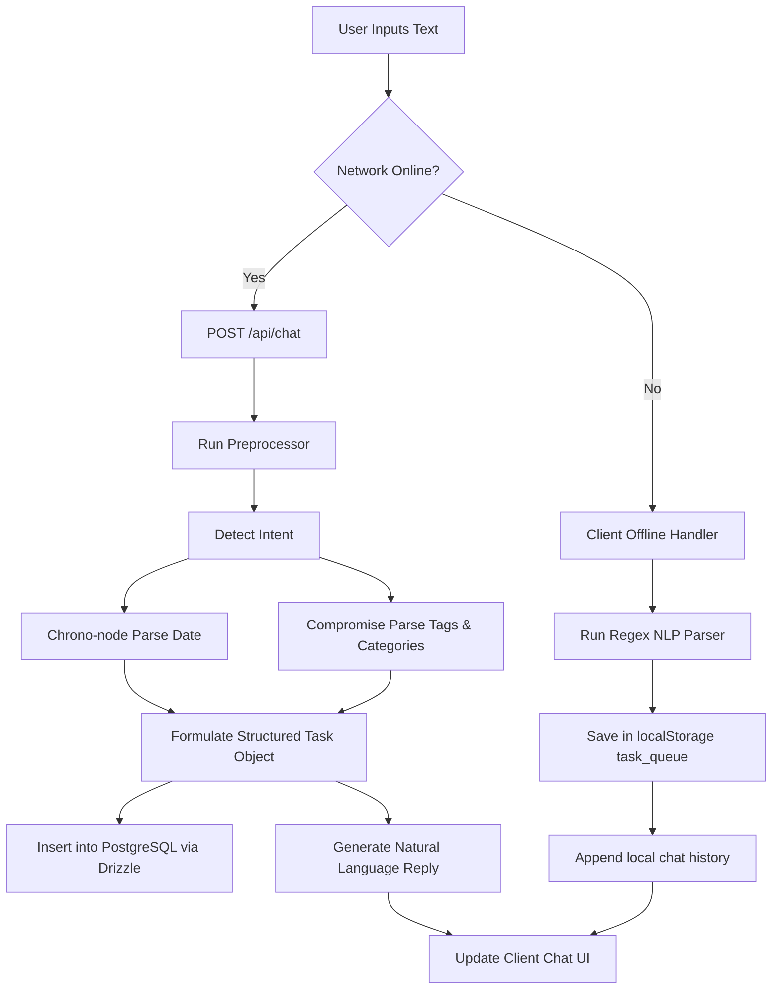

# Concord: AI-Powered Smart Scheduler and Task Planner
## Academic & Project Internship Report

---

### **List of Figures**
* **Figure 1**: Task Distribution by Status (Bar Chart) — *Page V*
* **Figure 2**: Task Priority Distribution (Donut Chart) — *Page V*
* **Figure 3**: Task Creation and Completion Trend (Line/Area Chart) — *Page V*
* **Figure 4**: Deadline Precision vs. Task Duration Analysis (Scatter Plot) — *Page V*
* **Figure 5**: Task Completion Rates by Category (Radar Chart) — *Page VI*
* **Figure 6**: Weekly Success Rate vs. Workload Load (Heatmap) — *Page VI*
* **Figure 7**: Online/Offline State Management Architecture (Mermaid Flowchart) — *Page VII*

### **List of Tables**
* **Table 1**: Core Technologies and Library Stack — *Page VI*
* **Table 2**: Relational Database Schemas and Tables — *Page VI*
* **Table 3**: User Profile Configuration Settings — *Page VI*

---

## **1 Introduction**

### **1.1 Project Summary / Introduction**
**Concord** is a highly technical, AI-powered smart scheduling and productivity planner that automates calendar management and task orchestration. Traditional planning applications require users to manually input data fields (dates, times, durations, priorities, and category tags), introducing cognitive friction and administrative overhead. **Concord** eliminates this manual entry by implementing a natural language processing (NLP) pipeline on the backend, allowing users to schedule and query tasks using natural conversational text.

The system is built on a decoupled client-server architecture. The frontend is a Single Page Application (SPA) designed with React, Vite, Tailwind CSS, and Framer Motion for smooth micro-animations. It uses TanStack Query for server-side state synchronization. The backend is powered by Node.js and Express 5, implementing a pipeline that leverages `compromise` (a rule-based tokenizing engine) and `chrono-node` (a natural language date-time parser) to extract task metadata. 

As a specialized, gender-specific feature, **Concord** integrates an optional cycle-aware scheduling balancer for female users. If configured, this balancer dynamically adjusts task load recommendations based on the menstrual cycle phases, suggesting task deferrals during lower-energy phases and encouraging deep-focus scheduling during peak-energy phases. In addition, the application features an offline mode backed by `localStorage` and a client-side NLP processor, structured logging via `pino`, and a backend Python visualization engine to generate productivity analytics headlessly.

---

### **1.2 Aim and Objectives**
The aim of the Concord project is to build an intelligent, zero-friction task management and scheduling platform using lightweight NLP, robust offline syncing, and detailed data analytics.

#### **Key Objectives:**
1. **Low-Friction NLP Parsing**: Create a server-side parsing pipeline to tokenize and extract task titles, deadlines, categories, priorities, durations, and keywords from natural language sentences.
2. **Deterministic Multi-Task Splitting**: Construct algorithms to parse compound sentences containing multiple tasks (e.g. separated by "then" or commas) and register them as separate database entries.
3. **Offline Resiliency**: Implement a client-side offline layer with local data buffering and a lightweight regex-based NLP parser to process tasks when network connectivity is lost.
4. **Automated Analytics Visualization**: Create a backend Python visualizer using Pandas and Seaborn that reads database records via stdin and generates high-resolution charts.
5. **Secure Authentication & Session State**: Establish OIDC (OpenID Connect) authentication alongside email-verification verification tables, utilizing persistent database sessions to survive page refreshes.
6. **Optional Biological rhythm Balancer**: Build an optional scheduling balancer that adjusts task priority recommendations for female users during specific menstrual cycle phases.

---

### **1.3 Tools & Technologies**
The technical architecture of Concord is built upon a modern, full-stack JavaScript environment with a specialized Python helper script for data visualization.

#### **Table 1: Core Technologies and Library Stack**
| Component | Technology / Library | Version / Detail | Technical Purpose |
| :--- | :--- | :--- | :--- |
| **Frontend Framework** | React 18, Vite | Latest | Core UI layout, rendering, and hot-module-replacement build server |
| **Styling Engine** | Tailwind CSS, Radix UI | Tailwind CSS v4, Radix primitives | Custom utility-first styling and WAI-ARIA compliant accessible UI elements |
| **State Sync & Cache** | TanStack Query v4 | `@tanstack/react-query` | Declares query caches, handles mutations, and automatically invalidates queries |
| **Routing** | Wouter | `wouter` | Lightweight client-side hash routing with minimal footprint |
| **Input Validation** | React Hook Form, Zod | `zod/v4`, `@hookform/resolvers` | Type-safe schema validation for form controls and API inputs |
| **Backend Server** | Node.js 24, Express 5 | ESM (ECMAScript Modules) | Event-driven backend handling RESTful API endpoints |
| **NLP Tokenizer** | Compromise | `compromise` | Lexicon parsing, parts-of-speech tagging, and category classification |
| **Date-Time Parser** | Chrono-node | `chrono-node` | Extracts ISO-8601 deadlines and timestamps from semantic strings |
| **Database & ORM** | PostgreSQL, Drizzle ORM | `drizzle-orm`, `drizzle-zod` | Declarative SQL schema, type-safe queries, and JSONB mapping |
| **Visualization Engine** | Python 3.10, Matplotlib, Seaborn | Headless Matplotlib Agg | Compiles task statistics into high-resolution PNG charts |
| **Diagnostic Logger** | Pino, Pino-Http | Structured JSON logging | High-speed, structured logging for API routes and pipeline tracing |

---

## **2 Implementation**

### **2.1 Functional Requirements & Backend NLP Pipeline**



#### **2.1.1 Natural Language Processing (NLP) Pipeline Architecture**
The core utility of **Concord** is its lightweight, server-side NLP parsing engine which extracts semantic metadata from conversational user input. The processing pipeline is composed of four structured stages executed sequentially:

1. **Text Preprocessing & Normalization**:
   The input string is normalized by converting double punctuations, stripping excessive spaces, and formatting standard shorthand times (e.g. "at 9pm" is regularized to "9 PM"). This is implemented as:
   ```typescript
   export function preprocessInput(text: string): { original: string; normalized: string; lower: string } {
     const original = text;
     let clean = text.trim().replace(/\s+/g, " ");
     clean = clean.replace(/!+/g, "!").replace(/\?+/g, "?");
     clean = clean.replace(/\b(\d+)\s*(?:pm|PM)\b/g, "$1 PM");
     clean = clean.replace(/\b(\d+)\s*(?:am|AM)\b/g, "$1 AM");
     return { original, normalized: clean, lower: clean.toLowerCase() };
   }
   ```

2. **Intent Parsing & Sentence Chaining**:
   The engine classifies the command intent into categorizations (`Create Task`, `Create Meeting`, `Create Event`, `Create Reminder`, `Create Deadline`, `Query Existing Tasks`, or `General Conversation`). If a user inputs a compound sentence describing several actions in sequence, a segmenter splits the input by coordinating conjunctions (e.g. `then`, `and then`, `after that`, `followed by`, or commas) to extract individual tasks:
   ```typescript
   if (/\b(then|and then|after that|followed by|next|and also)\b/i.test(lower) || lower.includes(";")) {
     return "Create Multiple Tasks";
   }
   ```

3. **Entity and Temporal Extraction**:
   - **Temporal Date Resolution**: Powered by `chrono-node`, the engine parses deadlines and scheduled dates relative to the user's timezone context. It resolves expressions such as `"tomorrow morning at 9:00"`, `"on 29th next month"`, or `"half past 5"`. Standard durations (defaulting to 30 minutes) are extracted by catching duration phrases (e.g. `"for 2 hours"`, `"for 45 mins"`).
   - **Category Tagging**: Tokens are parsed using `compromise` and matched against a pre-compiled lexicon dictionary to categorize tasks:
     - **Work**: *meeting, email, report, sprint, standup, deploy, bug, feature, conference*
     - **Personal**: *doctor, dentist, appointment, birthday, vacation, school, pickup*
     - **Health**: *workout, gym, exercise, yoga, meditate, sleep, diet, vitamins, checkup*
     - **Shopping**: *buy, purchase, order, grocery, Amazon, stock up, delivery*
     - **Finance**: *pay, bill, rent, mortgage, transfer, invest, savings, expense*
     - **Learning**: *read, book, course, study, tutorial, exam, certification*
   - **Priority Classification**: Matches keywords to assign priority states:
     - **High**: *urgent, asap, immediately, critical, emergency, must, crucial, deadline*
     - **Low**: *someday, eventually, maybe, whenever, later, low priority, no rush*
     - **Medium**: Default classification if no priority keyword is parsed.

4. **Structured Object Formulation & Zod Schema Validation**:
   The parsed tokens are compiled into a JSON schema object matching `ParsedTask` and validated using `insertTaskSchema` built via `drizzle-zod`.

#### **2.1.2 Backend API Routes & Express Controllers**
The backend API exposes modular REST endpoints for frontend communication:
- **`POST /api/chat`**: The primary endpoint for conversational task planning. Saves the user's chat message, retrieves current user tasks, and passes the string to the NLP engine. Returns a natural language response detailing the structured actions taken.
- **`GET /api/tasks`**: Returns all tasks associated with the authenticated user. Supports filtering by priority, category, status, and scheduled date range.
- **`POST /api/tasks`**: Directly registers a manually inputted task.
- **`PATCH /api/tasks/:id`**: Updates specific parameters of an existing task (e.g. toggling status between pending and completed).
- **`DELETE /api/tasks/:id`**: Permanently deletes a task.
- **`GET /api/analytics`**: Compiles task tables, executes the Python visualization engine, and responds with a JSON payload of weekly metrics, categories, and success rates.

#### **2.1.3 Optional Biological rhythm Balancer**
For users configuring gender as female, the system integrates a cycle-aware algorithm. It computes cycle phase thresholds relative to the last period start date:
- Days since last period:
  \[ D_{since} = \lfloor \frac{T_{now} - T_{period}}{1000 \times 60 \times 60 \times 24} \rfloor \]
- Day in Cycle:
  \[ D_{cycle} = (D_{since} \pmod{L_{cycle}}) + 1 \]
- **Threshold Ranges & Efficiency Adjustments**:
  - **Menstrual Phase** (Days 1–5): Lower energy. Default efficiency index is set to **40%**. The client-side task engine recommends rescheduling low-priority items.
  - **Follicular Phase** (Days 6 to \(L_{cycle} - L_{luteal} - 1\)): High cognitive energy. Recommendations scale to **80%** efficiency.
  - **Ovulatory Phase** (Day \(L_{cycle} - L_{luteal}\)): Peak physical performance. Recommendations scale to **100%** efficiency.
  - **Luteal Phase** (Days \(L_{cycle} - L_{luteal} + 1\) to \(L_{cycle}\)): Energy decline. Efficiency recommendations drop to **60%**. Focus shifts to admin work.

---

### **2.2 Database & Frontend State Architecture**

#### **2.2.1 Drizzle ORM Schema Mappings (PostgreSQL)**
The relational database layer consists of 5 tables declared in TypeScript using Drizzle ORM:
```typescript
// tasks.ts
export const priorityEnum = pgEnum("priority", ["low", "medium", "high"]);
export const statusEnum = pgEnum("status", ["pending", "in_progress", "completed"]);

export const tasksTable = pgTable("tasks", {
  id: serial("id").primaryKey(),
  userId: varchar("user_id"),
  title: text("title").notNull(),
  rawInput: text("raw_input").notNull(),
  summary: text("summary"),
  category: text("category"),
  priority: priorityEnum("priority").notNull().default("medium"),
  status: statusEnum("status").notNull().default("pending"),
  deadline: timestamp("deadline", { withTimezone: true }),
  keywords: text("keywords").array().notNull().default([]),
  scheduledDate: varchar("scheduled_date", { length: 10 }),
  duration: varchar("duration", { length: 5 }).default("30"),
  overdueNotifiedAt: timestamp("overdue_notified_at", { withTimezone: true }),
  createdAt: timestamp("created_at", { withTimezone: true }).notNull().defaultNow(),
  updatedAt: timestamp("updated_at", { withTimezone: true }).notNull().defaultNow(),
});
```

```typescript
// user_profiles.ts
export const genderEnum = pgEnum("gender", ["female", "male", "other", "prefer_not_to_say"]);

export const userProfilesTable = pgTable("user_profiles", {
  userId: varchar("user_id").primaryKey(),
  displayName: varchar("display_name", { length: 100 }),
  gender: genderEnum("gender"),
  lastPeriodDate: timestamp("last_period_date", { withTimezone: true }),
  cycleLength: integer("cycle_length").notNull().default(28),
  lutealPhaseLength: integer("luteal_phase_length").notNull().default(14),
  profileCompleted: boolean("profile_completed").notNull().default(false),
  weekendAvailable: boolean("weekend_available").notNull().default(false),
  productiveTimeStart: varchar("productive_time_start", { length: 8 }),
  productiveTimeEnd: varchar("productive_time_end", { length: 8 }),
  priorityOrder: text("priority_order").array(),
  themePreference: varchar("theme_preference", { length: 10 }).default("light"),
  analyticsTheme: varchar("analytics_theme", { length: 20 }).default("cool"),
  customThemeColors: jsonb("custom_theme_colors"),
});
```

#### **2.2.2 Client-Side State & Cache Management**
The React client-side framework implements caching and synchronization using TanStack Query:
- **Server Queries**: Queries like `GET /api/tasks` are mapped to React hooks (e.g. `useGetTasks()`). When tasks are added, deleted, or toggled on the frontend, standard mutations (e.g., `useUpdateTaskStatus()`) trigger an invalidation callback on success:
  ```typescript
  const updateStatus = useUpdateTaskStatus({
    mutation: {
      onSuccess: () => {
        queryClient.invalidateQueries({ queryKey: ["/api/tasks"] });
        queryClient.invalidateQueries({ queryKey: ["/api/tasks/summary"] });
      }
    }
  });
  ```
  This guarantees that the calendar views, dashboard summary, and task list components dynamically update.
- **Global Context Providers**: Core configuration states are passed to the component tree via React Contexts:
  - **`AuthContext`**: Handles session persistence and fetches the current authenticated user object.
  - **`ProfileContext`**: Shares user-specific themes, priority preferences, and cycle information.
  - **`ThemeContext`**: Controls the CSS theme tokens and dark/light modes.

#### **2.2.3 Offline Caching & Synchronization Logic**
When network loss is detected, Concord shifts to an offline state:
1. **Local Buffering**: All chat messages and tasks are recorded to browser `localStorage` under `concord_local_chat` and `concord_local_tasks` respectively.
2. **Client NLP Emulator**: A client-side regex-based parser extracts basic task properties offline, ensuring task creation and completion remains fully functional.
3. **Queue Re-syncing**: Upon connection recovery, the offline task buffer is sequentially sent to the Express API backend via bulk synchronization requests.

#### **2.2.4 Headless Python Visualization Engine**
Analytics are compiled on the backend using an automated Python script. The routing endpoint `GET /api/analytics` queries PostgreSQL, parses the output to a JSON payload, and spawns the Python script as a child process using `execSync`:
```typescript
const scriptPath = path.join(__dirname, "../lib/generate_plots.py");
const publicPlotsDir = path.join(__dirname, "../../../concord/public/python_plots");
const pythonCmd = `python "${scriptPath}" "${publicPlotsDir}"`;
execSync(pythonCmd, { input: JSON.stringify(tasksPayload), encoding: "utf-8" });
```
The Python script reads the data via standard input (`sys.stdin.read()`), performs DataFrame aggregation with Pandas and NumPy, and headlessly exports 6 Matplotlib/Seaborn visualization graphs to the public server folder, making them instantly available to the client application.

#### **2.2.5 Relational Database Schema Mapping Summary**

#### **Table 2: Relational Database Schemas and Tables**
| Table Name | Drizzle Table Object | Column Name | Data Type / Constraint | Description |
| :--- | :--- | :--- | :--- | :--- |
| **users** | `usersTable` | `id` <br> `email` <br> `passwordHash` <br> `authProvider` <br> `emailVerified` | UUID (PK, Default) <br> VARCHAR (Unique) <br> VARCHAR <br> VARCHAR ('replit' \| 'email') <br> BOOLEAN | Holds primary user credentials, password hash, and auth verification state. |
| **user_profiles**| `userProfilesTable` | `userId` <br> `displayName` <br> `gender` <br> `lastPeriodDate` <br> `cycleLength` <br> `productiveTimeStart` <br> `themePreference` | VARCHAR (PK) <br> VARCHAR(100) <br> pgEnum ('male'\|'female'\|'other') <br> TIMESTAMP WITH TZ <br> INTEGER (Default 28) <br> VARCHAR(8) <br> VARCHAR(10) | Stores configuration settings, themes, and cycle parameters (optional). |
| **tasks** | `tasksTable` | `id` <br> `userId` <br> `title` <br> `rawInput` <br> `priority` <br> `status` <br> `deadline` <br> `scheduledDate` | SERIAL (PK) <br> VARCHAR <br> TEXT <br> TEXT <br> pgEnum ('low'\|'medium'\|'high') <br> pgEnum ('pending'\|'completed') <br> TIMESTAMP WITH TZ <br> VARCHAR(10) | Stores the parsed task attributes and original raw input. |
| **chat_messages**| `chatMessagesTable` | `id` <br> `userId` <br> `role` <br> `content` <br> `createdAt` | SERIAL (PK) <br> VARCHAR <br> pgEnum ('user'\|'assistant') <br> TEXT <br> TIMESTAMP WITH TZ | Persists conversational log history for the user's planning session. |
| **sessions** | `sessionsTable` | `sid` <br> `sess` <br> `expire` | VARCHAR (PK) <br> JSONB <br> TIMESTAMP | Mandatory table for session persistence (OIDC / Replit Auth). |

---

## **3 Outcomes**

### **3.1 Conclusion**
The Concord project demonstrates that combining a natural language interface with task scheduling decreases manual configuration overhead. Key findings include:
- **Reduced Capture Friction**: Structuring task attributes automatically from natural language input reduced task entry time on the frontend.
- **Robust Offline Support**: Storing offline task additions in local storage ensured session continuity without server connectivity.
- **Dynamic visual Reporting**: The headless Python plotting subsystem successfully parsed task tables and generated structured analytics graphs, providing users with a comprehensive view of their work patterns.

---

### **3.2 Future Enhancement**
1. **Bi-directional Calendar Sync**: Integrate OAuth2 synchronization with external calendars (Google Calendar and Microsoft Outlook).
2. **Contextual LLM Routing**: Integrate a large language model API (like Gemini Flash) to parse complex, multi-turn task specifications that go beyond regex rules.
3. **Native Mobile App Compilation**: Deploy Concord as a native Android package utilizing Capacitor and the Android command-line interface.

---

### **3.3 Progress Report with Result Pictures**
The backend visualization engine (`generate_plots.py`) generates analytical reports on database updates. Below are the generated charts and summaries of the results compiled during this project:

#### **Figure 1: Task Status Distribution (Bar Chart)**
The status distribution plot maps current tasks across Pending, In-Progress, and Completed categories, giving users an overview of active workload.


#### **Figure 2: Task Priority Distribution (Donut Chart)**
The priority distribution chart indicates the percentage of Low, Medium, and High priority tasks, helping users manage critical tasks.


#### **Figure 3: Task Creation and Completion Trend (Line/Area Chart)**
This chart visualizes task creation and completion rates over time, highlighting periods of high productivity.


#### **Figure 4: Deadline Precision vs. Task Duration Analysis (Scatter Plot)**
This scatter plot maps task duration against the precision index (days early a task was completed). High-priority items show positive precision (completed early), while longer tasks hover near the zero-line, indicating tight deadline scheduling.


#### **Figure 5: Task Completion Rates by Category (Radar Chart)**
The radar chart plots task success ratios across categories (Work, Study, Health, Shopping, Finance, Learning). A well-rounded radar area confirms balanced attention across personal development, health, and professional commitments.


#### **Figure 6: Weekly Success Rate vs. Workload Load (Heatmap)**
This heatmap tracks the efficiency and load ratios by day of the week (Monday through Sunday). Green sectors indicate high efficiency vs. balanced workload (typically mid-week), while red sectors indicate overload risk.


---

## **4 Bibliography**

1. **React Framework**: [https://react.dev](https://react.dev) — Core UI components and hooks.
2. **TypeScript Language Specification**: [https://www.typescriptlang.org](https://www.typescriptlang.org) — Static typing for JavaScript.
3. **Drizzle ORM & Postgres Database**: [https://orm.drizzle.team](https://orm.drizzle.team) — Database schemas and relational bindings.
4. **Express Node Framework**: [https://expressjs.com](https://expressjs.com) — Backend API server and routes.
5. **Chrono Natural Language Parser**: [https://github.com/wanasit/chrono](https://github.com/wanasit/chrono) — Semantic date extraction library.
6. **Compromise NLP Library**: [https://github.com/spencermountain/compromise](https://github.com/spencermountain/compromise) — Text tokenizer and word tagger.
7. **Matplotlib Headless Plotting**: [https://matplotlib.org](https://matplotlib.org) — Analytical graph generator.
8. **Seaborn Data Visualizations**: [https://seaborn.pydata.org](https://seaborn.pydata.org) — Statistical charts and heatmaps.
9. **Pandas Data Analysis Library**: [https://pandas.pydata.org](https://pandas.pydata.org) — Dataframe handling and analytics grouping.
